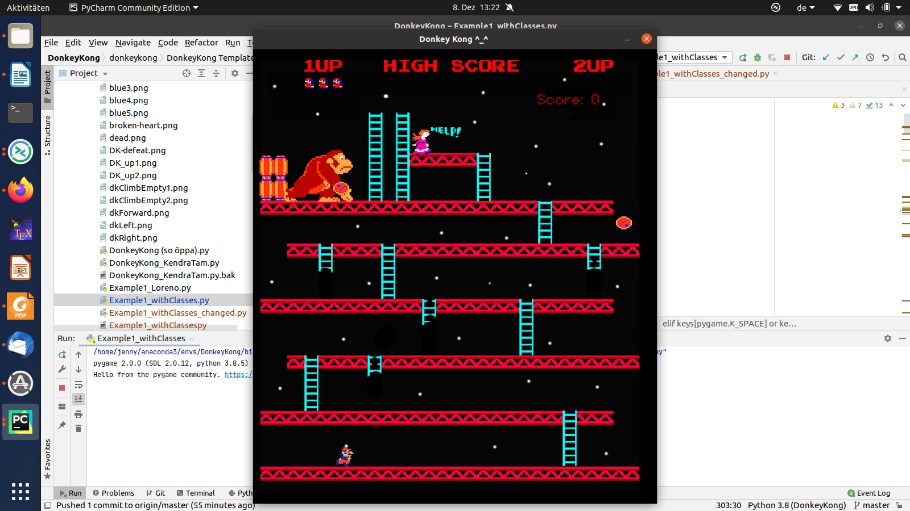

# MAT101: Programming (HS20), Python Project: Donkey Kong Game

# Sample Code

All the sample code that has been written during the exercise classes for the
programming project can be found here:

[https://git.math.uzh.ch/loheer/donkey-kong-examples](https://git.math.uzh.ch/loheer/donkey-kong-examples)

Some other code samples and exercises can be found on the lecture website here:

[https://www.math.uzh.ch/index.php?id=ve_vo_det&key1=0&key2=3927&semId=41](https://www.math.uzh.ch/index.php?id=ve_vo_det&key1=0&key2=3927&semId=41)

<!---
# Recordings of the Python Exercise Class and Donkey Kong Programming Project

Those are all the recordings from the exercise classes. They are un-edited and may be incomplete.

- [Recording from 08.12.2020](https://collab.math.uzh.ch/playback/presentation/2.0/playback.html?meetingId=3ba63cc7a3a7f5ca431207b15e5beede884ddf52-1607428857404)
- [Recording from 01.12.2020](https://collab.math.uzh.ch/playback/presentation/2.0/playback.html?meetingId=3ba63cc7a3a7f5ca431207b15e5beede884ddf52-1606824125655)
- [Recording from 24.11.2020](https://collab.math.uzh.ch/playback/presentation/2.0/playback.html?meetingId=3ba63cc7a3a7f5ca431207b15e5beede884ddf52-1606218985670)
- [Recording from 17.11.2020](https://collab.math.uzh.ch/playback/presentation/2.0/playback.html?meetingId=3ba63cc7a3a7f5ca431207b15e5beede884ddf52-1605614344319)
- [Recording from 10.11.2020](https://collab.math.uzh.ch/playback/presentation/2.0/playback.html?meetingId=3ba63cc7a3a7f5ca431207b15e5beede884ddf52-1605009593282)
- [Recording from 03.11.2020](https://collab.math.uzh.ch/playback/presentation/2.0/playback.html?meetingId=3ba63cc7a3a7f5ca431207b15e5beede884ddf52-1604404581771)
- [Recording from 20.10.2020](https://collab.math.uzh.ch/playback/presentation/2.0/playback.html?meetingId=3ba63cc7a3a7f5ca431207b15e5beede884ddf52-1603191343806)
- [Recording from 13.10.2020](https://collab.math.uzh.ch/playback/presentation/2.0/playback.html?meetingId=3ba63cc7a3a7f5ca431207b15e5beede884ddf52-1602586380909)
- [Recording from 06.10.2020](https://collab.math.uzh.ch/playback/presentation/2.0/playback.html?meetingId=3ba63cc7a3a7f5ca431207b15e5beede884ddf52-1601982042015)
- [Recording from 29.09.2020](https://collab.math.uzh.ch/playback/presentation/2.0/playback.html?meetingId=3ba63cc7a3a7f5ca431207b15e5beede884ddf52-1601377110227)
- [Recording from 22.09.2020](https://collab.math.uzh.ch/playback/presentation/2.0/playback.html?meetingId=3ba63cc7a3a7f5ca431207b15e5beede884ddf52-1600772629446)
- [Recording from 15.09.2020](https://collab.math.uzh.ch/playback/presentation/2.0/playback.html?meetingId=3ba63cc7a3a7f5ca431207b15e5beede884ddf52-1600167938677)
- [Recording from 10.09.2020](https://collab.math.uzh.ch/playback/presentation/2.0/playback.html?meetingId=583e73b417400072650f5c055516f64c007fd233-1599732352447)

-->
